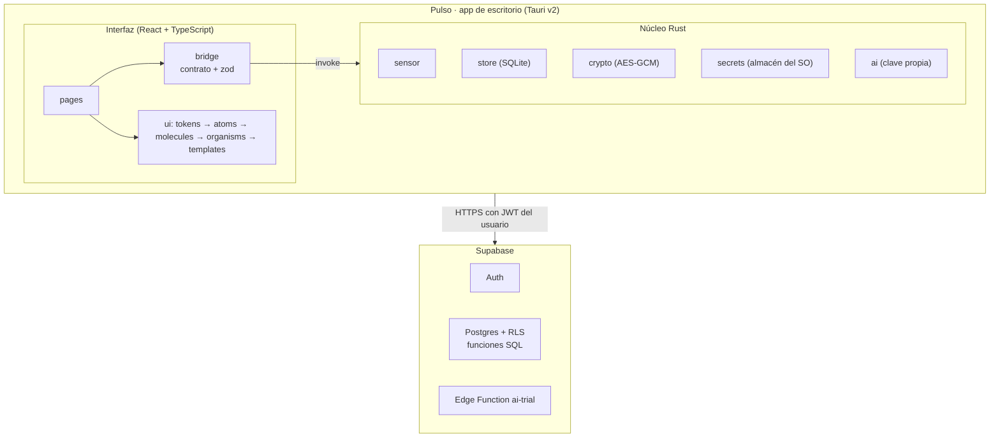

<div align="center">


# Pulso

**Entiende cómo trabaja tu equipo con IA, sin vigilarlo.**

App de escritorio para registrar tiempo y actividad, gestionar tareas y generar reportes con IA a partir de cifras calculadas.


</div>

> **Proyecto en construcción.** La v1 apunta a Windows 10/11 con entrega el **19 de octubre de 2026**.
> Este README distingue lo que ya existe de lo que está planificado (ver [Estado del proyecto](#estado-del-proyecto)).

## Tabla de contenido

- [Acerca del proyecto](#acerca-del-proyecto)
- [Estado del proyecto](#estado-del-proyecto)
- [Características principales](#características-principales)
- [Stack tecnológico](#stack-tecnológico)
- [Arquitectura y cómo funciona](#arquitectura-y-cómo-funciona)
- [Relación con el backend](#relación-con-el-backend)
- [Instalación y ejecución](#instalación-y-ejecución)
- [Estructura de carpetas](#estructura-de-carpetas)
- [Documentación](#documentación)
- [Cómo contribuir](#cómo-contribuir)
- [Licencia](#licencia)

## Acerca del proyecto

Pulso es una aplicación de escritorio para **equipos que trabajan con herramientas de IA**. Registra en qué se
usa el tiempo, organiza proyectos y tareas, y genera reportes en lenguaje natural.

**Qué problema resuelve:** los equipos no saben cuánto tiempo dedican a cada tipo de trabajo ni cómo usan la IA, y
las herramientas de monitoreo habituales invaden la privacidad. Pulso mide lo necesario y limita lo que se ve.

**Para quién:** equipos pequeños y sus líderes (roles de equipo: administrador, miembro y observador; roles de proyecto:
líder y colaborador).

**Principios de diseño** (decisiones cerradas en [`docs/ARQUITECTURA.md`](docs/ARQUITECTURA.md)):

- **Privacidad primero:** los títulos de ventana nunca salen del equipo y se guardan cifrados. Nunca se registran
  teclas, capturas de pantalla ni contenido de documentos o de chats de IA.
- **Las cifras salen de SQL, no de la IA.** La IA redacta la narrativa y solo puede citar cifras ya calculadas.
- **Los reportes son indicativos**, no prueba disciplinaria.
- **Permisos en la base de datos:** las reglas de roles viven en políticas RLS de Postgres y cada una tiene su prueba.

## Estado del proyecto

El desarrollo avanza por fases ([`docs/PLAN.md`](docs/PLAN.md)). Hoy **F0 está hecha** y **F1 está implementada y
verificada con la app real** (`docs/spikes/F1-medicion-app-real.md`), a la espera de aprobar su spec.

| Fase | Contenido | Estado |
|---|---|---|
| F0 · Fundaciones | Estructura, design tokens, atomic design, galería de componentes, CI, primera migración y pruebas de permisos | Hecho en gran parte |
| F1 · Sensor y *Mi día* | Sensor de actividad en Windows, SQLite local, vista *Mi día* | Implementada: sensor real, títulos cifrados, temporizador, descansos, pausa, registro manual y ajustes locales. Spec en espera de aprobación |
| F2 · Cuentas, equipos y sincronización | Auth, equipos, roles, invitaciones, sincronización | Planificado (ya existen las migraciones de equipos y de actividad y tiempo) |
| F3 · Proyectos y tareas | Lista, tablero y tiempo por tarea | Planificado |
| F4 · IA y reportes | Reportes con IA en tres modos | Planificado |
| F5 – F6 | Tableros por rol, privacidad, avisos, instalador | Planificado |

Las pantallas *Tareas*, *Equipo* y *Reportes* son hoy marcadores de posición que indican su fase.

## Características principales

**Disponibles hoy**

- Interfaz de escritorio con navegación, tema claro/oscuro y tres anchos de ventana.
- **Sensor de actividad en Windows** (app activa, título e inactividad cada 2 s), clasificación por reglas con
  detección de uso de IA, títulos cifrados con AES-256-GCM y clave en el almacén seguro del sistema. Funciona sin conexión.
- Vista **Mi día** con datos reales: franja del día, totales por categoría, temporizador, descansos, pausa de privacidad,
  registro manual de tiempo (crear, editar y eliminar) y actualización automática.
- **Ajustes** locales: umbral de inactividad y apps ocultas. Una sola instancia; cerrar Pulso detiene el registro.
- Sistema de diseño propio (tokens → átomos → moléculas → organismos → plantillas) con galería de componentes en desarrollo.
- Primera migración de Supabase (perfiles, equipos y miembros) con pruebas de permisos que corren sin Docker.
- Guardianes de calidad: lint, tipos, verificación de tokens de diseño y pruebas, ejecutados también en CI.

**Planificadas** (ver [`docs/FUNCIONALIDADES.md`](docs/FUNCIONALIDADES.md))

- Sensor de actividad en Windows con clasificación por categorías (`productive`, `neutral`, `distraction`, `ai`, `break`, `idle`, `paused`).
- Funcionamiento sin conexión y sincronización idempotente con la nube.
- Equipos, roles y tableros según permisos; proyectos y tareas.
- Reportes con IA en tres modos: Gratis (con cuota), Clave propia y Manual.
- Pausa de privacidad, exportación de datos propios y consentimiento versionado.

## Stack tecnológico

Versiones leídas de `package.json` y [`docs/STACK.lock.md`](docs/STACK.lock.md) (fuente de verdad de versiones).

| Capa | Tecnología | Versión |
|---|---|---|
| Shell de escritorio | Tauri | 2.12.1 |
| Interfaz | React / React DOM | 19.3.0 |
| Lenguaje | TypeScript | 6.0.3 |
| Estilos | Tailwind CSS (con design tokens propios) | 4.3.3 |
| Rutas | React Router (HashRouter) | 8.4.0 |
| Validación de contratos | Zod | 4.6.5 |
| Iconos y tipografías | lucide-react · Bricolage Grotesque · Figtree | 1.49.0 · 5.3.0 · 5.3.0 |
| Empaquetado | Vite | 8.3.2 |
| Núcleo nativo | Rust (edición 2024, mínimo 1.90) | estable |
| Backend | Supabase (Auth, Postgres con RLS, Edge Functions) | CLI 2.119.0 vía `npx` |
| Pruebas | Vitest · Testing Library · PGlite (Postgres en memoria) | 5.0.3 · 16.3.3 · 0.5.8 |
| Calidad | ESLint · typescript-eslint | 10.11.0 · 8.71.0 |
| Entorno | Node.js | 22 o superior |

Instaladas en F1 (Rust): `windows`, `rusqlite`, `aes-gcm`, `keyring`, `uuid` y `chrono`.
Aprobadas pero aún sin instalar: `@supabase/supabase-js`, `@tanstack/react-query`, `reqwest`, entre otras.

## Arquitectura y cómo funciona

Un solo repositorio con una interfaz React y un **núcleo Rust deliberadamente delgado**. La interfaz no ejecuta SQL ni
ve secretos: habla con Rust únicamente a través del **puente** (`src/bridge/contract.ts`), validado con Zod.



> Diagrama de la arquitectura **objetivo**. Hoy existen `sensor`, `store`, `crypto` y `secrets` (F1); `ai` llega en F4.

**Dos formas de ejecutar la interfaz**

- `npm run dev`: en el navegador con el **puente simulado** (`src/bridge/mock.ts`), sin necesidad de Rust. La interfaz
  muestra "Datos de ejemplo".
- `npm run tauri dev`: la app de escritorio real, con los comandos de Rust.

**Flujo principal previsto (Mi día)**

1. El sensor de Rust lee la app activa cada 2 s y cierra bloques de actividad al cambiar la app o la categoría.
2. `store` guarda los bloques en SQLite local; el título de ventana se guarda cifrado.
3. La página *Mi día* llama `day_view(date)` por el puente; la respuesta se valida con Zod y se pinta con los componentes de `src/ui`.
4. (F2) La sincronización en TypeScript pide los pendientes **sin títulos** y los sube a Supabase con `upsert` idempotente.

Hoy los pasos 1 a 3 funcionan con la app real; el paso 4 llega en F2.

## Relación con el backend

El backend es **Supabase**, incluido en este mismo repositorio (`supabase/`); no hay un repositorio de backend separado.

- **Protocolo:** HTTPS con el JWT del usuario, mediante `supabase-js` (aún no instalado; llega en F2).
- **Datos:** Postgres con RLS en cada tabla; escrituras sensibles solo mediante funciones `SECURITY DEFINER`.
- **Hoy:** existen las migraciones `20261001000001_identidad_y_equipos.sql` (`profiles`, `teams`, `team_members`) y
  `20261005000001_actividad_y_tiempo.sql` (`activity_blocks` sin títulos, `time_entries`, `classification_rules`), con sus pruebas.
  Aún no están aplicadas en la nube.
- **IA gratuita:** Edge Function `ai-trial` con cuota diaria (planificada, F4).
- **Contrato Rust ⇄ interfaz:** lista cerrada de comandos en [`docs/ARQUITECTURA.md`](docs/ARQUITECTURA.md) §6.

Más detalle en [`supabase/README.md`](supabase/README.md).

## Instalación y ejecución

**Requisitos**

- [Node.js 22 o superior](https://nodejs.org) y Git.
- Para la app de escritorio: [Rust](https://rustup.rs) y las *Microsoft C++ Build Tools* (ver [`docs/COMO-VERIFICAR.md`](docs/COMO-VERIFICAR.md)).
- Para usar Supabase en la nube: un archivo de entorno propio (no se versiona; el repositorio incluye una plantilla de ejemplo).

**Pasos**

```bash
git clone https://github.com/StehvenObandoUcc/app-escritorio.git
cd app-escritorio
npm install
npm run verify     # lint + tipos + guardián de tokens + pruebas de interfaz y de base de datos
npm run dev        # interfaz en el navegador con datos de ejemplo → http://localhost:1420
npm run tauri dev  # app de escritorio real (la primera compilación tarda unos minutos)
```

La galería de componentes (solo en desarrollo) está en <http://localhost:1420/#/dev/galeria>.

**Scripts útiles**

| Comando | Qué hace |
|---|---|
| `npm run verify` | Lint + tipos + tokens + pruebas. **Obligatorio antes de cada entrega** |
| `npm run test:ui` / `npm run test:db` | Solo pruebas de interfaz / de permisos (Postgres en memoria, sin Docker) |
| `npm run verify:rust` | Clippy + pruebas de Rust (al tocar `src-tauri`) |
| `npm run build` | Comprueba tipos y empaqueta la interfaz |

## Estructura de carpetas

```
.github/          CI (GitHub Actions), CODEOWNERS y plantilla de pull request
docs/             plan, arquitectura, decisiones (ADR), specs, diseño, roles e IA
prompts/          prompts versionados para los reportes
scripts/          guardianes de calidad (p. ej. verificación de tokens de diseño)
src/
  app/            componente raíz y enrutamiento
  bridge/         contrato con Rust + implementación simulada (mock) y real (tauri)
  dev/            galería de componentes (solo desarrollo)
  lib/            utilidades sin interfaz
  pages/          páginas: conectan datos con la interfaz (mi-dia y marcadores de posición)
  ui/
    tokens/       design tokens: único lugar con valores de diseño
    atoms/        piezas mínimas: Button, Input, Badge…
    molecules/    combinaciones pequeñas: FormField, TimerControl…
    organisms/    bloques completos: PulseStrip, ActivityList, AppNav
    templates/    estructuras de página: AppShell, PageLayout
src-tauri/        núcleo Rust (Tauri v2), capacidades e iconos
supabase/
  migrations/     SQL: tablas, RLS y funciones (fuente de verdad de permisos)
  tests/          pruebas de permisos con Postgres en memoria
  functions/      Edge Functions (IA gratuita, planificadas)
```

## Documentación

| Quiero… | Leo… |
|---|---|
| Saber qué se construye y cuándo | [`docs/PLAN.md`](docs/PLAN.md) |
| Ver todas las funcionalidades y su fase | [`docs/FUNCIONALIDADES.md`](docs/FUNCIONALIDADES.md) |
| Entender la arquitectura y las decisiones cerradas | [`docs/ARQUITECTURA.md`](docs/ARQUITECTURA.md) |
| Saber quién puede hacer qué | [`docs/ROLES.md`](docs/ROLES.md) |
| Entender cómo se usa la IA y las claves | [`docs/IA.md`](docs/IA.md) |
| Hacer interfaz (tokens, atomic design, responsive) | [`docs/DISENO.md`](docs/DISENO.md) |
| Comprobar que algo funciona | [`docs/COMO-VERIFICAR.md`](docs/COMO-VERIFICAR.md) |
| Saber qué versiones usar | [`docs/STACK.lock.md`](docs/STACK.lock.md) |
| Trabajar con agentes de IA | [`AGENTS.md`](AGENTS.md) |

## Cómo contribuir

1. Lee [`AGENTS.md`](AGENTS.md) y [`docs/ARQUITECTURA.md`](docs/ARQUITECTURA.md): si algo no está en la arquitectura ni en una spec, **no se implementa**; se pregunta.
2. Trabaja contra la spec de tu tarea en `docs/specs/` (plantilla en `docs/specs/_PLANTILLA.md`).
3. Crea una rama a partir de `main` y mantén los cambios pequeños y limitados a los archivos de tu tarea.
4. No agregues dependencias sin un ADR aprobado en `docs/adr/`; actualiza `docs/STACK.lock.md` en el mismo cambio.
5. Ningún color, tamaño o radio se escribe a mano fuera de `src/ui/tokens/`.
6. Antes de abrir el *pull request* ejecuta `npm run verify` (y `npm run verify:rust` si tocaste Rust). Usa la plantilla de PR del repositorio.
7. Nunca incluyas secretos en código, pruebas, registros ni prompts.

Convención de commits usada en el historial: `tipo(ámbito): descripción` (por ejemplo `feat(mi-dia): …`, `docs: …`).

## Licencia

**Por confirmar.** El repositorio no incluye un archivo `LICENSE`.
